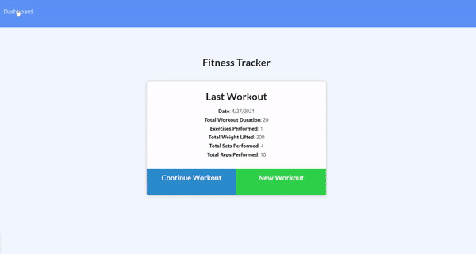

# NoSQL Fitness Tracker


## Description
A workout tracker that allows users to log resistance and cardio workouts. This application uses a NoSQL MongoDB database to store the users workout data.

## Table of Contents
* [Links](#links)
* [Animation](#animation) 
* [Instructions](#instructions) 
* [Installation](#installations) 
* [Tests](#tests) 
* [Technologies](#technologies)  
* [License](#license)
* [Contact](#contact)

## Links
Published URL: [https://nosql-fitness-log.herokuapp.com/](https://nosql-fitness-log.herokuapp.com/)

Repository: [https://github.com/spencercreer/nosql-fitness-tracker](https://github.com/spencercreer/nosql-fitness-tracker)


## Animation
The following animation demonstrates the application functionality:
</br>


## Instructions
The homepage displays the last logged workout. The user may add another exercise to this workout by clicking the "Continue Workout" button. The user may begin a new workout by clicking the "New Workout" button. The dashboard provides an overview of workouts logged.
## Installation
To install necessary dependencies, run the following command:

  ```
  npm install
  npm i express
  npm i mongoose
  npm i morgan
  ```
## Tests
To run tests, run the following command:

  ```
  Tests in development
  ```
    
## Contribute
Please submit a PR if you would like to contribute.
## Technologies
 * JavaScript
 * HTML
 * CSS
 * Node.js
 * npm
 * MongoDB
 * Mongoose
 * Heroku
 * Express


## License
This project is licensed under the MIT license.
## Contact
For questions or comments, please contact me.

Email: <a href="mailto: spencercreer@gmail.com" target="_blank">spencercreer@gmail.com</a>

GitHub: [spencercreer](https://github.com/spencercreer/)
